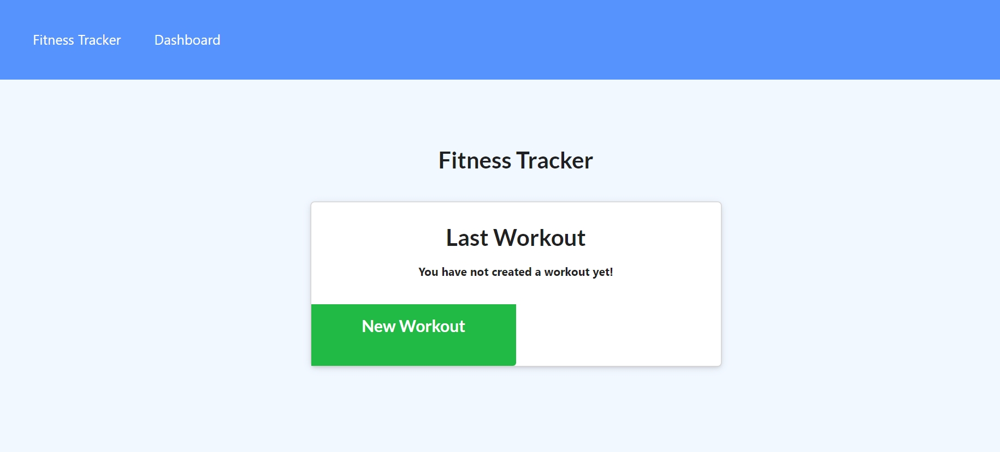

# Homework Assignment 18-Workout Tracker

## Description:
This week's homework required us to build the back end for a workout tracker application with an existing front end. The finished back end was to include a MongoDB database with a Mongoose schema and routes handled by Express.js. This application allows users to view, create and track daily workouts. Users can also log multiple exercises in a workout on a given day. Finally, users are also able to track the name, type, weight, sets, reps, and duration of exercise. 

## Installation Instructions:
-You can use this application via its deployed link on Heroku: https://immense-headland-48390.herokuapp.com/

-To use this application locally: First, clone this repository. Navigate to the directory containing repository in your terminal. Then, open your terminal. 

1. In your terminal, enter "npm install" to install all of the application's dependencies. 
2. *OPTIONAL* In your terminal, enter "npm run seed" to run the seed data 
3. In your terminal, enter "npm start" to start the server and deploy the application.

## Built With:
* HTML
* CSS
* Javascript
* [Node JS](https://nodejs.org/en/)
* [Express](https://www.npmjs.com/package/express)
* [MongoDB](https://www.npmjs.com/package/mongodb)
* [Mongoose](https://www.npmjs.com/package/mongoose)
* [DotEnv](https://www.npmjs.com/package/dotenv)
* [Morgan](https://www.npmjs.com/package/morgan)

## Deployed Links:
* [Link to GitHub Repo](https://github.com/egraham96/FitnessTracker)
* [Link to Deployed Application on Heroku](https://immense-headland-48390.herokuapp.com/)

## Screenshot of Deployed Application: 

## How to Contribute:
If you'd like to contribute to this project please send an email to eegraham4@gmail.com. Thank you for your interest!

## How to Test the Application:
Please see the installation instructions above. 

## License:

Copyright 2021 Emma Graham

Permission is hereby granted, free of charge, to any person obtaining a copy of this software and associated documentation files (the "Software"), to deal in the Software without restriction, including without limitation the rights to use, copy, modify, merge, publish, distribute, sublicense, and/or sell copies of the Software, and to permit persons to whom the Software is furnished to do so, subject to the following conditions:

The above copyright notice and this permission notice shall be included in all copies or substantial portions of the Software.

THE SOFTWARE IS PROVIDED "AS IS", WITHOUT WARRANTY OF ANY KIND, EXPRESS OR IMPLIED, INCLUDING BUT NOT LIMITED TO THE WARRANTIES OF MERCHANTABILITY, FITNESS FOR A PARTICULAR PURPOSE AND NONINFRINGEMENT. IN NO EVENT SHALL THE AUTHORS OR COPYRIGHT HOLDERS BE LIABLE FOR ANY CLAIM, DAMAGES OR OTHER LIABILITY, WHETHER IN AN ACTION OF CONTRACT, TORT OR OTHERWISE, ARISING FROM, OUT OF OR IN CONNECTION WITH THE SOFTWARE OR THE USE OR OTHER DEALINGS IN THE SOFTWARE.

